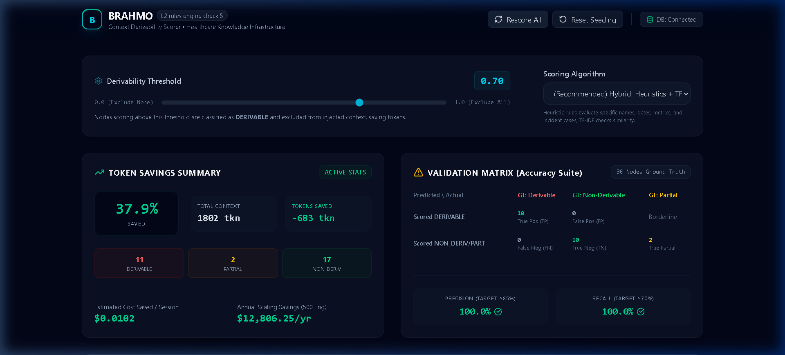
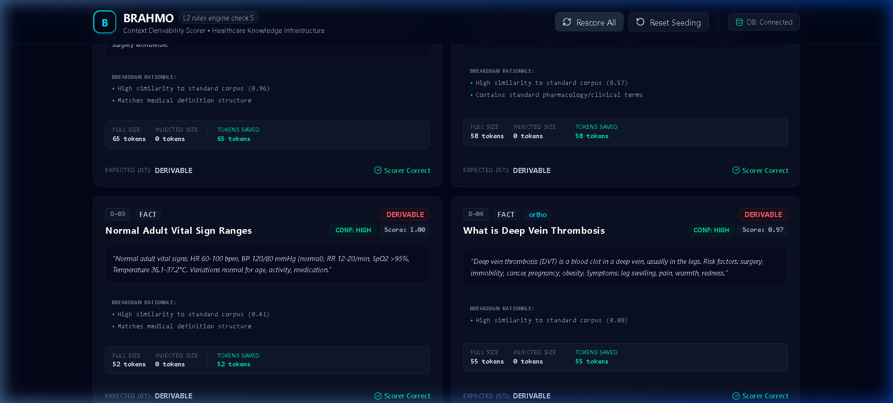
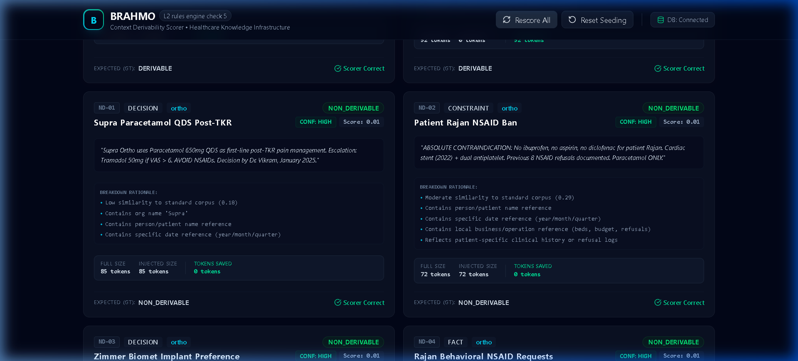
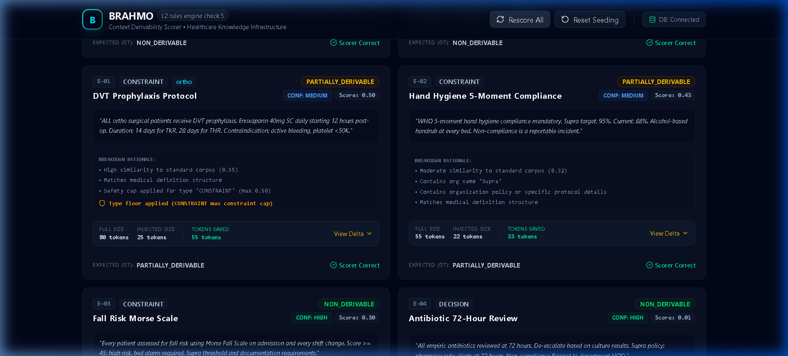
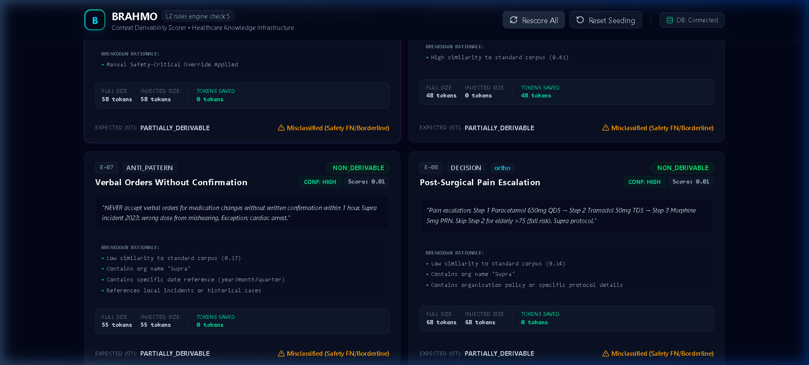

<div align="center">

# BRAHMO — Derivability Scoring System
### Token Savings Engine · L2 Rules Engine · Check 5

[](https://fastapi.tiangolo.com/)
[](https://react.dev/)
[](https://www.typescriptlang.org/)
[](https://python.org)
[](https://sqlite.org/)
[]()
[]()

**Classifies 30 healthcare knowledge nodes as DERIVABLE / PARTIALLY_DERIVABLE / NON_DERIVABLE  
using a hybrid TF-IDF + heuristic algorithm. Zero LLM calls at runtime. Pre-computed. Instant.**

</div>

---

## The Problem

When Dr. Vikram opens an AI session at Supra Hospital, the Rules Engine retrieves 28 candidate knowledge nodes to inject into the prompt. One of them is:

> *"Total knee replacement (TKR) is a surgical procedure where damaged knee joint surfaces are replaced with artificial components."*

Claude **already knows this**. It's in every medical textbook. Those ~65 tokens are completely wasted.

The next node says:

> *"Supra Ortho uses Paracetamol 650mg QDS post-TKR. Escalation: Tramadol 50mg if VAS > 6. Decision by Dr. Vikram, January 2025."*

Claude **cannot** know this. It's Supra-specific. These tokens are essential.

Across 28 nodes, ~40–60% contain general medical knowledge. BRAHMO filters these out — saving tokens, reducing cost, keeping context lean. **Zero LLM calls at query time.** Scores are pre-computed and stored; retrieval is a single SQL `WHERE` clause.

---

## Three Classifications

| Class | Score | Action | Token Impact |
|-------|:-----:|--------|:------------|
| 🔴 **DERIVABLE** | ≥ 0.70 | Excluded entirely from prompt | Full tokens saved |
| 🟡 **PARTIALLY_DERIVABLE** | 0.40–0.69 | Only org-specific delta injected | Partial savings |
| 🟢 **NON_DERIVABLE** | < 0.40 | Full content always injected | No savings — essential |
| 🟣 **OVERRIDDEN** | forced 0.01 | `never_exclude` flag — always injected | Full content, always |

---

## Dashboard



At default threshold **0.70** across all 30 nodes:
- **37.9% token savings** — 683 tokens saved out of 1,802 total per session
- **Precision: 100%** (target ≥ 85%) — no false positives at default threshold
- **Recall: 100%** (target ≥ 70%) — all derivable nodes correctly caught
- **Estimated savings:** $0.0102/session → **$12,806/yr** at 500 engineers × 10 sessions/day

---

## Scoring Algorithm — Hybrid TF-IDF + Heuristics

All scoring is **pre-computed at node creation or batch rescore**. Zero LLM calls at runtime.

### Step 1 — TF-IDF Cosine Similarity

A local reference corpus of 14 general medical documents (TKR, Sepsis, Paracetamol, Vital Signs, WHO guidelines, etc.) is built at server startup. Each node's content is tokenized and its cosine similarity to the corpus is computed.

```
Similarity > 0.40   →  base score = 0.85 + (sim − 0.40) × 0.25
Similarity 0.20–0.40 →  base score = 0.64 + (sim − 0.20) × 1.15
Similarity ≤ 0.20   →  base score = 0.25
```

### Step 2 — Heuristic Adjustments

Eight regex-based signals adjust the base score:

| Signal | Condition | Adjustment |
|--------|-----------|:----------:|
| Org name detected | "Supra" in content | **−0.40** |
| Person / patient name | Dr., Patient, Mrs. pattern | **−0.30** |
| Specific date or quarter | Year/month/quarter reference | **−0.20** |
| Local operations | Beds, budget, refusal counts | **−0.20** |
| Incident reference | "incident", "near-miss", "mishearing" | **−0.30** |
| Org policy combined | Protocol + org signal together | **−0.15** |
| Patient documentation style | "nurse documents", "behavioral note" | **−0.20** |
| Definitional structure | Starts with "X is a…" | **+0.20** |
| Standard pharmacology terms | mg, QDS, IV, BD (no org signals) | **+0.15** |

### Step 3 — Type-Based Safety Floor Caps

Applied from `org_config.type_floors` — configurable per organization, no code change needed:

| Node Type | Max Score | Reason |
|-----------|:---------:|--------|
| `CONSTRAINT` | **0.50** | Clinical rules must never be fully excluded |
| `ANTI_PATTERN` | **0.60** | Past incident learnings must stay in context |
| `DECISION` | 1.0 | No cap — org decisions can be derivable |
| `FACT` | 1.0 | No cap — general facts can be fully excluded |

### Step 4 — Confidence + Safety Override

- **HIGH** — score far from threshold with strong signals
- **LOW** — score within ±0.10 of threshold → routed to Clinician Review Queue
- **MEDIUM** — everything else
- **HIGH (Override)** — `never_exclude = true` forces score 0.01, skips all scoring

---

## Knowledge Node Cards



Each node card shows: **ID · Type · Department · Classification badge · Confidence · Score · Full content · Breakdown Rationale · Token counts (Full / Injected / Saved) · Ground Truth validation (✅ Scorer Correct / ⚠️ Misclassified)**



**Breakdown Rationale** is logged on every card — you can trace exactly which signals fired, what score adjustment was applied, and whether a type floor cap was enforced.

---

## Edge Cases — Partial Delta Extraction



For PARTIALLY_DERIVABLE nodes, only the org-specific **delta** is injected:

| Node | Full Size | Delta Injected | Tokens Saved |
|------|:---------:|:--------------:|:------------:|
| E-01 DVT Prophylaxis | 80 tokens | 25 tokens | **55 tokens** |
| E-02 Hand Hygiene | 55 tokens | 22 tokens | **33 tokens** |
| E-03 Fall Risk Morse Scale | 65 tokens | 20 tokens | **45 tokens** |

The delta is extracted by splitting content at sentence boundaries and tagging each sentence with the heuristic signals it triggers. Only untagged (general) sentences are dropped.

---

## Safety Override — `never_exclude`



E-05 "Blood Transfusion Verification" was involved in a Supra near-miss incident in 2024. It is pre-seeded with `never_exclude = true`. Regardless of threshold or score, this node is **always** injected. The purple 🛡️ badge marks it on the dashboard.

---

## Setup

### Requirements
- Python 3.11+ · Node.js 18+

### Backend

```bash
cd backend
python -m venv venv

# Windows
.\venv\Scripts\Activate.ps1

# macOS / Linux
source venv/bin/activate

pip install -r requirements.txt
python -m uvicorn app.main:app --host 127.0.0.1 --port 8000
```

- Runs on **http://127.0.0.1:8000**
- Auto-creates SQLite DB and seeds all 30 nodes on first startup
- API docs (Swagger): **http://127.0.0.1:8000/docs**

> **Supabase (optional):** Create `backend/.env` with:
> ```
> SUPABASE_URL=https://your-project.supabase.co
> SUPABASE_KEY=your-anon-key
> ```
> Falls back to SQLite silently if credentials are missing or invalid.

### Frontend

```bash
cd frontend
npm install
npm run dev
```

Open **http://localhost:5173**

### Docker — One Command

```bash
docker-compose up --build -d
```

| Service | URL |
|---------|-----|
| Dashboard | http://localhost |
| API Docs | http://localhost:8000/docs |

### Running Tests

```bash
cd backend
python -m pytest -v
```

Expected: **16 passed**. Covers derivable scoring, non-derivable scoring, edge case floors, surprise node, type floor enforcement, never_exclude override, and confidence classification.

---

## Project Structure

```
├── backend/
│   ├── app/
│   │   ├── scorer.py       # Hybrid TF-IDF + heuristic scoring engine
│   │   ├── seed.py         # 30 ground-truth knowledge nodes
│   │   ├── main.py         # FastAPI REST endpoints
│   │   ├── database.py     # Supabase + SQLite dual adapter
│   │   └── config.py       # Environment config + fallback logic
│   └── tests/
│       └── test_scorer.py  # 16 unit tests
├── frontend/
│   └── src/
│       ├── App.tsx         # Full dashboard (~988 lines)
│       └── index.css       # Dark theme
├── docs/
│   ├── architecture.md     # Algorithm design + calibration plan
│   ├── screenshots/        # Dashboard screenshots
│   ├── ENVIRONMENT_SETUP.md
│   ├── AI_STARTER_PROMPT.md
│   └── DATA_RESEARCH_GUIDE.md
├── data_sources.md         # Clinical data provenance (all 30 nodes)
├── docker-compose.yml
└── README.md
```

---

## API Reference

| Method | Endpoint | Description |
|--------|----------|-------------|
| `GET` | `/api/health` | Health check — returns DB mode (sqlite/supabase) |
| `GET` | `/api/org/{org_id}` | Get org config — threshold + type floors |
| `POST` | `/api/org/{org_id}/config` | Update threshold and/or type floors |
| `GET` | `/api/nodes?org_id=supra` | All 30 scored nodes |
| `POST` | `/api/rescore?org_id=supra` | Batch rescore all nodes against current config |
| `POST` | `/api/test-node` | Score a new node without saving to DB |
| `POST` | `/api/seed` | Wipe and re-seed the database |

---

## The 30 Nodes — Ground Truth Summary

| Group | IDs | Expected Class | Score Range |
|-------|-----|:--------------:|:-----------:|
| Clearly Derivable | D-01 to D-10 | DERIVABLE | ≥ 0.70 |
| Clearly Non-Derivable | ND-01 to ND-10 | NON_DERIVABLE | < 0.30 |
| Edge Cases (Ambiguous) | E-01 to E-10 | PARTIALLY_DERIVABLE | 0.30 – 0.70 |

All 30 nodes have an `expected_derivability` ground truth label. The **Validation Matrix** on the dashboard computes live precision/recall against these labels after every rescore.

---

## Key Design Decisions

- **Hybrid over pure LLM:** Pre-computable, explainable, zero runtime cost, full audit trail
- **SQLite fallback:** Anyone can clone and run immediately — no cloud credentials required
- **Type floors in config:** Safety constraints are config-driven, not hardcoded
- **`never_exclude` flag:** Safety-critical nodes bypass all scoring permanently
- **Clinician Review Queue:** Borderline nodes (score 0.60–0.80 or LOW confidence) are surfaced for human validation before exclusion is trusted
- **Per-node scoring reason:** Every decision is logged — essential for clinical audit environments

Full algorithm documentation, calibration plan, and tradeoff analysis: [`docs/architecture.md`](docs/architecture.md)  
Clinical data provenance for all 30 nodes: [`data_sources.md`](data_sources.md)

---

<div align="center">

Built for the **BRAHMO Full-Stack Developer Assessment (08A)**  
*Astroum AI · Healthcare Knowledge Infrastructure*

</div>
